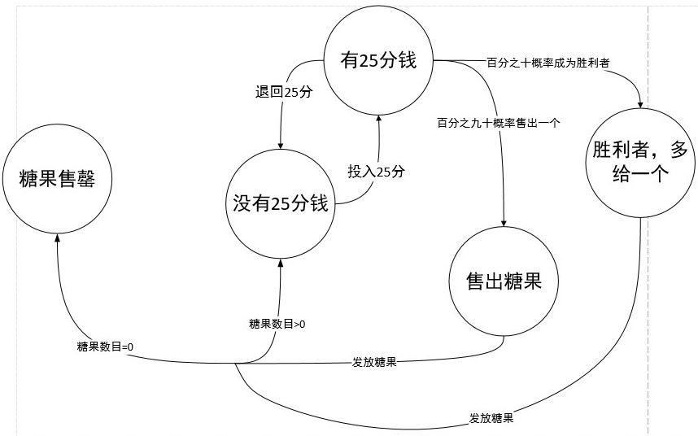

## 内容

​	现在有一个糖果机，这个糖果机的状态图如下。

​	对于这种状态图，最好的设计方式就是对每个状态列一个类，然后在每个类中，根据可以进行的操作，比如insertQuarter，ejectQuarter，turnCrank，dispense等操作，然后进行各个状态的切换。而糖果机类中只需要包含所有可能存在的状态的实例以及当前状态，然后有外界可以操作该糖果机的方法，即可实现该糖果机。

## 类图

