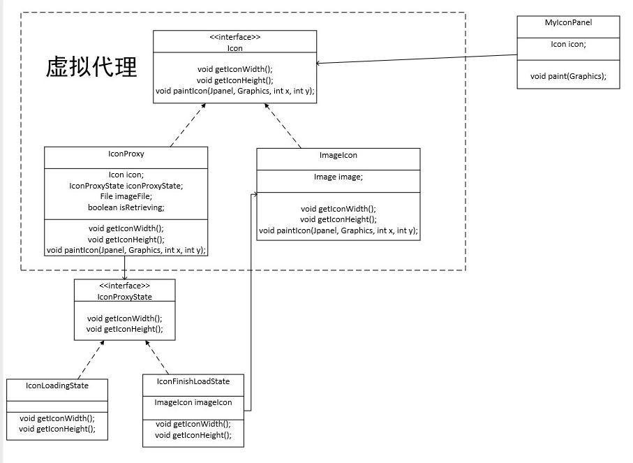
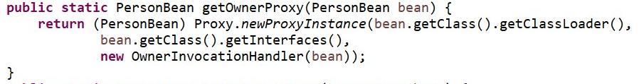
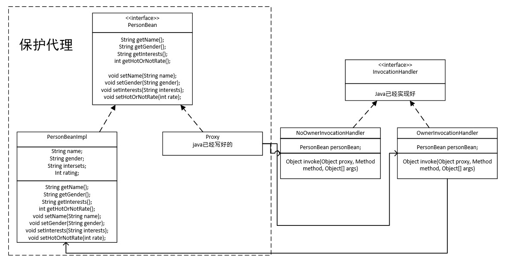

# 虚拟代理

## 内容

​	现在希望在一个窗口上显示一张图片，用panel来显示。由于加载图片是需要时间的，所以在等待的这段时间先显示一个loading的字符串。

​	这里就采用虚拟代理的方式，虚拟代理的含义就是当用户由一个请求时，虚拟代理先自己处理，然后请求真正的服务器端要求它们立即去完成准备工作，完成后再通过虚拟代理请求服务器端去工作。

​	因而MyIconPanel所拿到的Icon的实现其实是一个IconProxy，当要进行paint时，IconProxy先自己draw一个loading，然后new一个线程去获取图片，当获取完之后再进行repaint一下，通过MyIconPanel的paint函数，然后这次经由IconProxy交给ImageIcon去draw。

## 类图

# 保护代理

# 内容

​	想实现这样一个功能，由很多个人，每个人都有自己的名字、性别、兴趣以及他人的好感度。其中名字、性别、兴趣只能是自己修改，而好感动是由他人修改的，所以函数的可见性要因人而异。所以这里引入了保护代理，保护代理就是应对每个人的请求，然后决定该人是否可以修改某个人的属性。

​	在这里采用了java自带的代理，这个代理是一个动态代理，动态代理的含义是代理类并不是实现创建好的，而是在运行过程中你给定相应的方法来创建的。因而代理是java写好的，那么我们需要去实现另一个接口InvocationHandler来响应代理的调用，也就是在这里判断哪些方法可以调用，哪些方法不能调用。

​	

​	动态代理是这样创建的。

##类图

