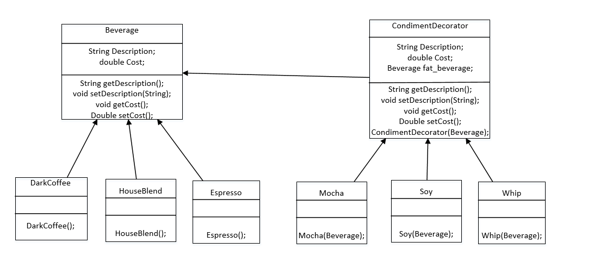

## 内容

这一章是装饰者模式。有一家咖啡店，有很多种咖啡，比如darkcoffee，houseblend，espresso，同时每种咖啡都可以加很多种调料，比如mocha，whip，soy等，这样我们希望能对一个加了很多的调料的咖啡计算它的价格。显然加了很多调料的咖啡有很多种。咖啡需要封装一下，调料也需要封装一下，这些都可能引入新的，而调料可以加很多次，那么我们就可以把调料当作装饰，来加入到咖啡种。

## 类图

