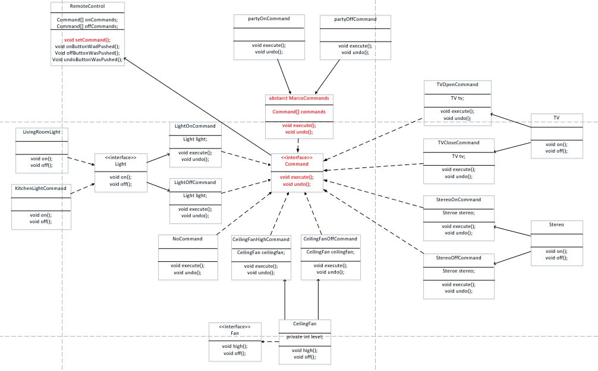

## 内容

​	现在到命令模式，背景是这样的，我们现在需要一个遥控器，然后这个遥控器上有很多组按钮，每一组按钮控制一个电器的开关和撤销三个功能，包括有living room light、kitchen light、ceiling fan、tv、stereo等。然后还有一个大按钮控制整个遥控器的撤销。

​	显然，我们可以对每个按钮进行封装，用一个Command接口来封装，Command接口有两个方法，execute和undo；同时，命令模式要求有一个Invoker，这个Invoker主要有一个setCommand的方法，相当于把命令绑到遥控器上。然后用户就可以通过这个遥控器去执行相应的命令。这样得到的命令有LightOnCommand、LightOffCommand等等。其中我们加入了一个NoCommand的空命令，这个很有用，有些按钮不能用时可以直接赋为空命令。

​	现在我们需要加入一个新的需求：比如我们需要有一个按钮可以控制party模式，即这个模式要求打开某些灯，然后打开电视，打开stereo。这样的话相当于把一些command组合到了一起，这就用到了宏命令(marco command)，用一个abstract class来实现Command接口，包含一个属性Comand类型的数组，然后覆盖execure和undo即可。

​	同时：对于living room light和kitchen light可以用工厂模式来封装一下。

## 类图

