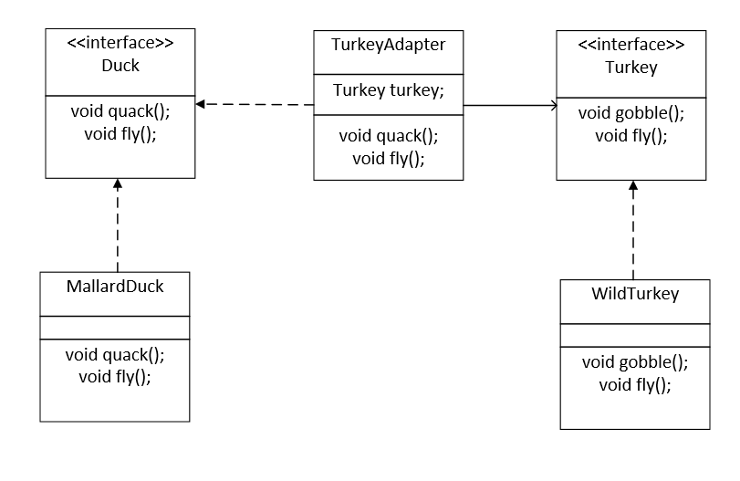
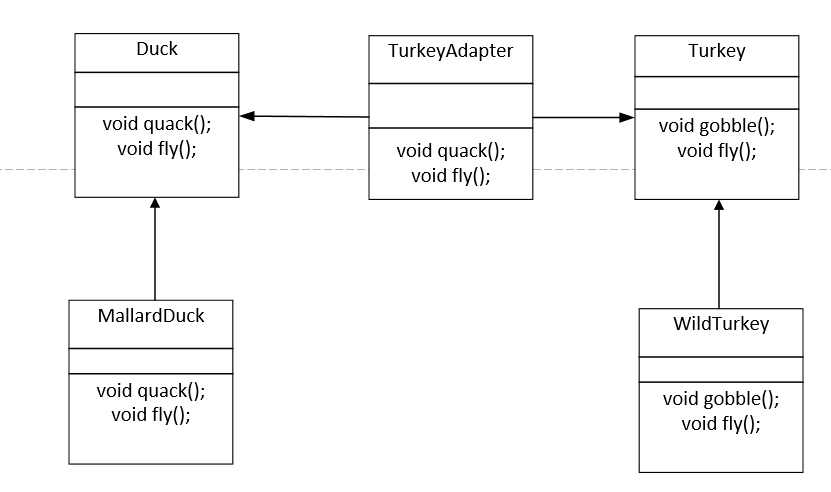

## 内容

​		适配器模式：背景如下：现在有我们有一群鸭子，同时有一群火鸡，我们希望能把火鸡装扮一下，在外界看来就像是鸭子一样。即真实情况就是有一群很老的接口，然后我们希望能让这些很老的接口能跟我们最新的接口一样，而不改变老的接口的逻辑，显然用一个适配器包装一下就好。所以适配器模式就是改变的接口。

​		适配器有两类：

  1. 对象适配器：即有两个接口Duck和Turkey，然后我们要把火鸡包装成鸭子，引入一个TurkeyAdapter类来实现这两个接口，然后这个类中有一个Turkey对象。

     

2. 类适配器：这个java实现不了，因为不能有多重继承。我们让TurkeyAdapter分别继承Duck和Turkey，然后这样就可以减少对象适配器的组合那一步了。

   

和适配器模式相关的，同样是封装类的接口的，适配器模式往往是封装一个类，而外观模式(facade-pattern），一般是封装多个类。比如上一章命令模式中有一个宏命令，就是外观模式，即我们需要一个partyon的命令，需要开tv、开steroe、开灯，这样我们把这些命令封装成一个宏命令，就是一个外观模式。

外观模式可以很好的去符合的墨忒耳原则：

​	在对象内部的方法，只能调用属于以下范围的方法：

1. 该对象本身。
2. 被当作方法的参数而传递进来的对象。
3. 此方法所创建或实例化的任何对象。
4. 对象的任何组件。